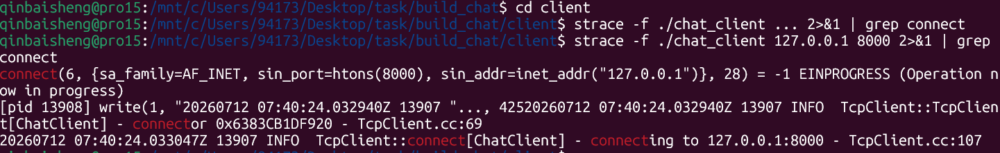
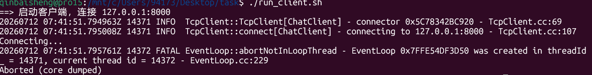
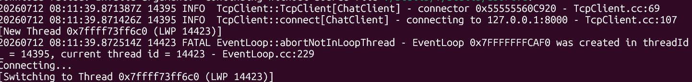
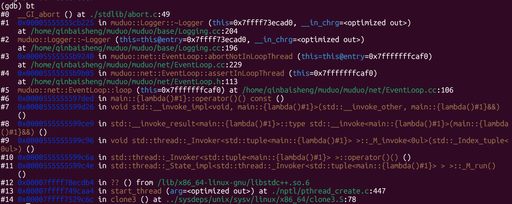
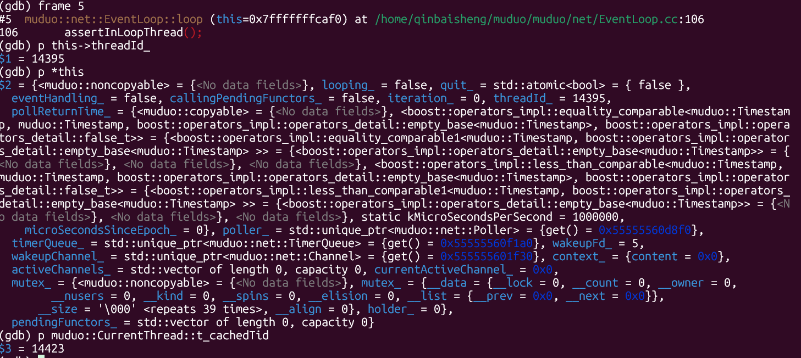

# Dev Log

> 记录开发过程中遇到的问题、排查思路与结论。新条目加在顶部。

---

## BUG #1：客户端连接超时（Connection timeout）

### 现象
`chat_client` 连 `chat_server` 报 `Connection timeout`，服务端日志为空。

### 根因
客户端 `main` 里 `TcpClient::connect()` 之后只有 `while(!connected()) usleep` 空转，
**从未调用 `EventLoop::loop()`**。muduo 的 connector 依赖所在 EventLoop 线程跑 `poll()`
才能把排队的函数分发执行，loop 不跑则 SYN 永远发不出去，服务端自然看不到连接。

### 排查方法

| 手段 | 命令 | 结论 |
|------|------|------|
| **strace** | `strace -f ./chat_client 127.0.0.1 8000 2>&1 \| grep connect` | 看不到 `connect()` 系统调用 → connector 未执行 |
| **gdb** | `b muduo::net::EventLoop::loop` / `b muduo::net::Connector::startInLoop` | 断点不命中 → loop 从未运行 |

### 修复
`client/chat_client.cc` 把 `EventLoop` 放到独立线程 `ioThread([&loop]{ loop.loop(); })` 跑起来，
stdin 在主线程读；`quit` 时 `loop.quit()` 并 `ioThread.join()`。

### 验证
修复后，客户端连接正常，服务端日志也正常。



---

## BUG #2：EventLoop 跨线程调用导致 abort 崩溃

### 现象
客户端线程抛出 abort 异常，服务端日志正常。



### 根因
`EventLoop loop` 在 main 线程创建，但 `loop.loop()` 被放到 `ioThread`（另一个线程）调用。
muduo 的 `loop()` 入口第一件事就是断言 `isInLoopThread()`，检测到线程 ID 不匹配 → `LOG_FATAL` → `abort()`。

### GDB 排查过程

#### 1. 在 abort 上设断点，抓 crash 现场
```bash
gdb ./chat_client
(gdb) b abort
(gdb) r 127.0.0.1 8000
```



> 上图：线程调用不属于它的事件循环，导致异常抛出。

#### 2. 打印调用栈，定位触发点
```bash
(gdb) bt
```



关键帧：
```
#5  EventLoop::loop()           → 入口断言检查
#4  EventLoop::assertInLoopThread()  → 检测线程不匹配
#3  EventLoop::abortNotInLoopThread() → LOG_FATAL
#0  __GI_abort()                → 进程被杀
```

#### 3. 查看线程 ID，确认不一致
```bash
(gdb) frame 5
(gdb) p this->threadId_         # EventLoop 创建时记录的主线程 ID
(gdb) p muduo::CurrentThread::t_cachedTid   # 当前 ioThread 的 ID
```



> 如我们所看，ioThread 线程 ID 与主线程 ID 不一致，导致 abort。

### 修复
**正确做法：main 线程创建 EventLoop，也必须在 main 线程调 `loop()`。**

```cpp
// main 线程：创建 + 调用（同线程）
EventLoop loop;
loop.loop();    // ✓

// stdin 线程：通过 sendEnvelope → runInLoop 安全投递
std::thread stdinThread([&]() {
    client.sendEnvelope(env);  // 内部用 runInLoop，安全
});
```

---

## 知识总结

### 一、什么是 abort 崩溃（信号 SIGABRT）

程序打印 `Aborted (core dumped)` 代表进程收到 `SIGABRT` 信号，和段错误（`SIGSEGV`）本质完全不同：

| | SIGSEGV（段错误） | SIGABRT（abort 退出） |
|---|---|---|
| 性质 | 被动崩溃 | 主动自杀 |
| 触发者 | 操作系统 / MMU | 程序代码 / 标准库 |
| 原因 | 非法内存访问（野指针、越界、空指针） | 主动调用 `abort()` |
| 目的 | 保护系统 | 阻止数据损坏、死锁、内存错乱 |

**`abort()` 底层行为：**
- 向自身发送 `SIGABRT` 信号
- 默认行为：生成 core 转储文件、终止整个进程
- 无法被 `try-catch` 捕获（属于进程信号，不是 C++ 异常）

### 二、触发 abort() 的三大核心场景

#### 1. C 内存管理错误（libc 主动 abort）
libc 的内存分配器检测到堆损坏时直接调用 `abort()`：
- 重复释放内存：`free(p)` 执行两次
- 释放非法指针：栈变量、全局变量直接 `free`
- 内存越界写破坏堆元数据（堆溢出）

#### 2. C++ 未捕获异常（标准强制行为）
C++ 标准规定：线程抛出异常且无 `try-catch` 捕获时，自动调用 `std::terminate()`，默认实现就是 `abort()`。

**多线程最大坑：** 裸 `std::thread` 运行的函数抛异常，无法在主线程 `try-catch`，直接触发 abort。

#### 3. 标准库断言 assert()
调试代码中 `assert(条件)`，条件不成立时调用 `abort()`。

### 三、muduo 的 One Loop Per Thread 设计

#### 为什么一个线程一个事件循环？

**核心原因：避免锁竞争**，这是传统多线程网络库最大的性能瓶颈。

**传统做法（多线程共享一个 EventLoop）：**
```
Thread A: epoll_wait → 回调 → 操作 sharedState → 加锁
Thread B: epoll_wait → 回调 → 操作 sharedState → 加锁
                                        ↓
                              锁竞争 → 上下文切换 → 性能下降
```

**muduo 的做法（one loop per thread）：**
```
Thread A: EventLoop A → 处理连接 1,2,3    （独立，不锁）
Thread B: EventLoop B → 处理连接 4,5,6    （独立，不锁）
Thread C: EventLoop C → 处理连接 7,8,9    （独立，不锁）
                                        ↓
                              无锁 → 线性扩展 → 连接数翻倍性能也翻倍
```

#### 跨线程怎么办？

用 `runInLoop` 把任务投递到目标线程执行，而不是直接操作别人的数据：
```
Thread A 想发消息给 Thread B 管的连接：
    loop_B->runInLoop([msg]{
        // 这段代码在 Thread B 执行，不竞争
        conn->send(msg);
    });
```

#### 对比总结

| | 共享 EventLoop | One Loop Per Thread |
|---|---|---|
| 锁竞争 | 高（每操作都锁） | 无（各自独立） |
| 扩展性 | 差（线程多反而慢） | 好（线性扩展） |
| 代码复杂度 | 高（到处加锁） | 低（单线程逻辑清晰） |
| 适用场景 | 连接数少 | 海量连接（C10K/C100K） |

> muduo 能用少量线程处理几万并发连接——每个线程专注自己的 EventLoop，零锁竞争，CPU 缓存命中率高，性能接近单线程但又能利用多核。

跨线程事件通知使用 `eventfd` 和同步队列来实现，保证线程之间的安全通信。
